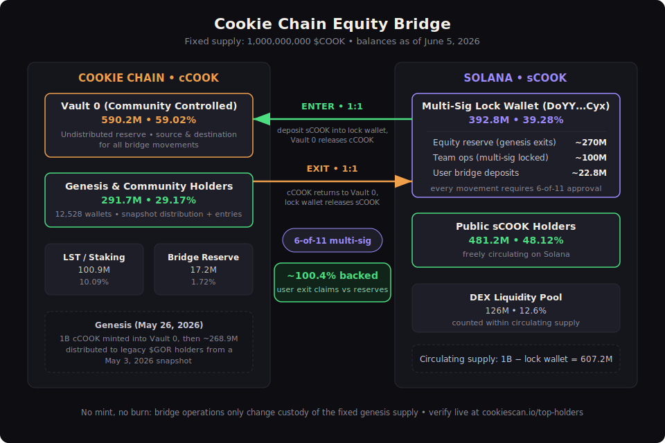

# Cookie Chain ($COOK) Tokenomics White Paper

**Version 2.0**
**Date:** June 5, 2026
**Last Updated:** June 5, 2026 (balances as of June 5, 2026, 10:53 AM PT)

## Official Links
- Website: https://cookiechain.wtf
- Explorer: https://cookiescan.io
- Bridge: https://bridge.cookiescan.io
- Docs: https://docs.cookiechain.wtf
- Community Multi-Sig (Cookie Chain side): https://cookiequads.vercel.app/community (and https://sig.cookiechain.wtf)
- Solana Multi-Sig (Squads): https://app.squads.so/squads/DoYYCtcG2vfrE3HtxBBXiNVieMutvWBXsgbF3SKtYCyx
- Solana CA (sCOOK): 36ZrtQoab5MhhySaP1YSTwUahSk6GRVUTtZ6cuVfm9e1
- Twitter: @TheCookieChain
- Telegram: t.me/TheCookieNetChain

## Executive Summary

Cookie Chain is a high-performance, community-operated Solana Virtual Machine (SVM) Layer 1 blockchain, launched May 26, 2026 as a community rescue of the Gorbagana ecosystem, whose holders had no way to move value out of the chain.

$COOK has a fixed total supply of 1,000,000,000 tokens. Holders on the legacy chain received cCOOK on Cookie Chain at genesis through a snapshot distribution, and their exits are guaranteed by an equity reserve of sCOOK that the project purchased and locked in a community multi-sig on Solana. As of June 5, 2026, user exit claims are backed at approximately 100.4% by locked reserves. All bridge movement in both directions is 1:1, multi-sig governed, and publicly auditable.

The structure is transitional, with a planned migration to a Hyperlane bridge for native burn/mint mechanics.

## 1. Background & Genesis

### 1.1 The Legacy Chain Problem

Cookie Chain originated as a community rescue of the Gorbagana ecosystem. Gorbagana operated as an SVM chain with its native token $GOR, but it never deployed a functional bridge. Holders inside the ecosystem had no path to move value out. Their tokens were effectively trapped, a situation the community referred to as the "gulag supply."

### 1.2 The Genesis Snapshot

On May 3, 2026, the community took a complete snapshot of all $GOR balances on the legacy chain (snapshot ID: gorbagana-snapshot-20260503). Cookie Chain launched on May 26, 2026 with this snapshot as its genesis state:

1. The full supply of 1,000,000,000 cCOOK was minted at genesis into the Community Controlled Wallet (Vault 0).
2. Every wallet captured in the snapshot was credited cCOOK in proportion to its legacy $GOR holdings, distributed out of Vault 0. This genesis distribution totaled approximately 268.9M cCOOK (~26.9% of supply).
3. Project operational wallets (LST Staking Rewards, Bridge Reserve) were funded from Vault 0 at genesis.
4. The remainder stays in Vault 0 as the bridge distribution reserve.

**Key point: the community supply on Cookie Chain did not arrive through the bridge. It was a genesis distribution honoring legacy holders.** The bridge governs all movement between chains after genesis.

### 1.3 Backing the Genesis Holders

Because genesis holders received cCOOK without ever depositing anything on Solana, the project created an equity reserve to guarantee their exit path:

- $COOK was launched on Solana (sCOOK) via Pump.fun with a supply of 1,000,000,000.
- The project acquired approximately 27% of the sCOOK supply (~270M) on the open market and via developer allocation, and deposited it into the community multi-sig lock wallet on Solana. This reserve alone covers the ~268.9M genesis distribution at roughly 100.4%.
- The team additionally acquired and deposited 10% of sCOOK supply (~100M), reserved for marketing, rewards, and future operational fees. This allocation moves only by 6-of-11 multi-sig approval and is never used for bridge settlement.

This 27% equity reserve is what makes the bridge an **equity bridge**: exits by genesis holders are paid from reserves the project purchased and locked, not from newly minted tokens.

## 2. Token Overview

| Property | Value |
|---|---|
| Name / Ticker | Cookie ($COOK) |
| Total Supply | 1,000,000,000 (fixed, no further minting) |
| Decimals | 9 |
| Native form | cCOOK on Cookie Chain (SVM L1) |
| Solana form | sCOOK, SPL token, CA: 36ZrtQoab5MhhySaP1YSTwUahSk6GRVUTtZ6cuVfm9e1 |
| Canonical listing asset | sCOOK on Solana |
| Utility | Gas, staking and LST rewards, bridging, dApp ecosystem |

### 2.1 One Asset, Two Representations

$COOK exists as two mirrored representations: cCOOK native to Cookie Chain and sCOOK on Solana. They are not two separate 1B supplies. The bridge and its reserves keep the user-accessible supply anchored at 1,000,000,000, as reconciled in Section 3.4. cCOOK held in Vault 0 is the undistributed mirror of sCOOK circulating on Solana; sCOOK held in the Solana lock wallet is the reserve backing cCOOK circulating on Cookie Chain.

## 3. Token Allocation, Bridge Mechanics & Supply Reconciliation

### 3.1 Wallet Allocation (as of June 5, 2026)

| Wallet | Side | Address | Balance | % of Supply | Role |
|---|---|---|---|---|---|
| Community Controlled Wallet (Vault 0) | Cookie Chain | `G3mm95M4ns7mk8oseWGJnirvgyMahMz3vZEUhdJn8oGX` | 590,222,436 cCOOK | 59.02% | Undistributed reserve; source of cCOOK for bridge entries; destination for cCOOK on exits |
| LST / Staking Rewards | Cookie Chain | `HXV5qzn7fezEifX7BYx13Z8Yi5wZvpUcgm5fQ1gfE5m3` | 100,879,769 cCOOK | 10.09% | Staking reward distribution |
| Bridge Reserve Wallet | Cookie Chain | `BTUTiNcsrYFCsmAxQN4diwp7JT8cobthygR4vV5bnr2D` | 17,221,221 cCOOK | 1.72% | Bridge liquidity and claims support |
| Genesis & community holders | Cookie Chain | distributed (12,528 wallets) | 291,676,574 cCOOK | 29.17% | Snapshot distribution to legacy holders plus post-genesis bridge entries |
| Community Multi-Sig Lock Wallet | Solana | `DoYYCtcG2vfrE3HtxBBXiNVieMutvWBXsgbF3SKtYCyx` | ~392.8M sCOOK | 39.28% | Equity reserve, team allocation, and user bridge deposits (see 3.2) |
| DEX Liquidity Pool | Solana | `DRaD...Ezx` | ~126M sCOOK | ~12.6% | Liquidity pool backing sCOOK trading on Solana DEXs |
| Public sCOOK holders | Solana | distributed | ~481.2M sCOOK | ~48.12% | Freely circulating on Solana |

### 3.2 Composition of the Solana Lock Wallet (39.28%)

The lock wallet balance is not a single category. It consists of:

| Component | Amount | % of Supply | Purpose |
|---|---|---|---|
| Equity reserve | ~270M sCOOK | ~27% | Purchased by the project to back exits by genesis holders. Never used for any other purpose. |
| Team operations allocation | ~100M sCOOK | ~10% | Marketing, rewards, future fees. Locked; moves only by 6-of-11 multi-sig. Never used for bridge settlement. |
| User bridge deposits | ~22.8M sCOOK | ~2.28% | sCOOK deposited by users entering Cookie Chain since launch |

### 3.3 How the Bridge Works

**Entering Cookie Chain (Solana → Cookie Chain)**
1. User deposits sCOOK into the Solana multi-sig lock wallet.
2. An equal amount of cCOOK is released from Vault 0 to the user's Cookie Chain address.

**Exiting Cookie Chain (Cookie Chain → Solana)**
1. User's cCOOK is returned to Vault 0.
2. An equal amount of sCOOK is released from the Solana lock wallet to the user's Solana address.

Every movement in either direction is 1:1 and executed under 6-of-11 community multi-sig control on both sides. No tokens are minted or burned in bridge operation; the fixed genesis supply simply changes custody.

### 3.4 Supply Reconciliation (as of June 5, 2026)

The test of the equity bridge is whether every user-held token has a guaranteed redemption path.

- User-held cCOOK on Cookie Chain (exit claims): **291,676,574** (~268.9M genesis distribution + ~22.8M bridged in)
- sCOOK in the Solana lock wallet available against exits: ~270M equity reserve + ~22.8M user deposits = **~292.8M**
- **Exit backing ratio: ~100.4%**, with the 17.2M cCOOK Bridge Reserve Wallet as additional buffer
- The team operations allocation (~100M sCOOK) and Vault 0 are excluded from user claims and from backing calculations.

Whole-system check: 607.2M circulating sCOOK + 291.7M user-held cCOOK + 100M locked team allocation ≈ 998.9M, reconciling to the 1B fixed supply within the over-collateralization buffer.

All balances are publicly auditable in real time at cookiescan.io/top-holders and on Solana explorers at the addresses above.

### 3.5 Circulating Supply Methodology

The canonical listed asset is sCOOK on Solana. For market data aggregators:

> **Circulating Supply = 1,000,000,000 − Solana Multi-Sig Lock Wallet balance**

Excluded address:
- `DoYYCtcG2vfrE3HtxBBXiNVieMutvWBXsgbF3SKtYCyx` (Solana lock wallet: equity reserve, team operations allocation, and bridge deposits)

Resulting circulating supply: approximately **607,200,000 $COOK** (as of June 5, 2026). This figure includes the ~126M sCOOK held in the DEX liquidity pool, consistent with standard aggregator treatment of open market liquidity.

Chain-side wallets (Vault 0, Bridge Reserve, LST Rewards) are cCOOK reserves that mirror the Solana-side supply and are not part of the sCOOK circulating calculation; they are disclosed in Section 3.1 for full transparency. Because cCOOK in user hands is backed by sCOOK locked in the excluded wallet, supply is counted once across both chains.

## 4. Governance & Security

- Cookie Chain side: 6-of-11 multi-sig
- Solana side: Squads multi-sig with matching members
- Future: Broader DAO

**Precedents**: Equity/reserve models like WBTC, stablecoin bridges, and early chain migrations.

**Transition Plan**: Phased move to Hyperlane Warp Routes for native burn/mint, reducing reserve dependency.

## 5. Token Utility & Economics

- Gas fees on Cookie Chain
- Staking & LST rewards
- Bridge operations
- dApp ecosystem (Cookoven, CookieSwap, BakedBazaar, etc.)

## Glossary

- **$COOK**: The native utility token of Cookie Chain. Used for gas fees, staking, bridging, and ecosystem activity.
- **sCOOK**: Solana-side representation of $COOK (Pump.fun launched SPL token).
- **cCOOK**: Native Cookie Chain-side representation of $COOK.
- **Genesis Snapshot Distribution**: The launch-day crediting of cCOOK to all wallets holding $GOR on the legacy chain, in proportion to their snapshot balances (~268.9M cCOOK).
- **Equity Bridge**: The current 1:1 community multi-sig bridge, backed by a purchased sCOOK reserve rather than mint/burn. sCOOK is locked on Solana to enter; cCOOK returns to Vault 0 and sCOOK is released to exit.
- **Equity Reserve**: The ~27% of sCOOK supply purchased by the project and locked in the Solana multi-sig to guarantee exits for genesis holders.
- **Community Controlled Wallet / Vault 0**: Main pre-minted reserve on Cookie Chain (`G3mm95M4ns7mk8oseWGJnirvgyMahMz3vZEUhdJn8oGX`).
- **Bridge Reserve Wallet**: Dedicated Cookie Chain wallet for bridge liquidity (`BTUTiNcsrYFCsmAxQN4diwp7JT8cobthygR4vV5bnr2D`).
- **Solana Multisig / Lock Wallet**: Holds the equity reserve, team operations allocation, and user bridge deposits on Solana (`DoYYCtcG2vfrE3HtxBBXiNVieMutvWBXsgbF3SKtYCyx`).
- **Multi-Sig**: Community governance system (6-of-11 threshold) using Cookiequads and Squads for transparent control of key wallets and bridge operations.
- **Hyperlane Bridge**: Planned upgrade for native burn/mint mechanics, reducing reliance on equity reserves.
- **LST**: Liquid Staking Token for staking rewards on Cookie Chain.
- **Gulag Supply**: Legacy trapped tokens from Gorbagana that the genesis snapshot and equity bridge unlocked.

## Conclusion

Cookie Chain's genesis snapshot honored every legacy holder, and the purchased equity reserve guarantees their path out, backed at over 100% as of this writing. Combined with 6-of-11 multi-sig governance on both chains and fully public wallet addresses, the model provides verifiable user protection during migration while building toward a Hyperlane-based native bridge and broader decentralization.

**This is not financial advice. DYOR and verify on cookiescan.io.**
